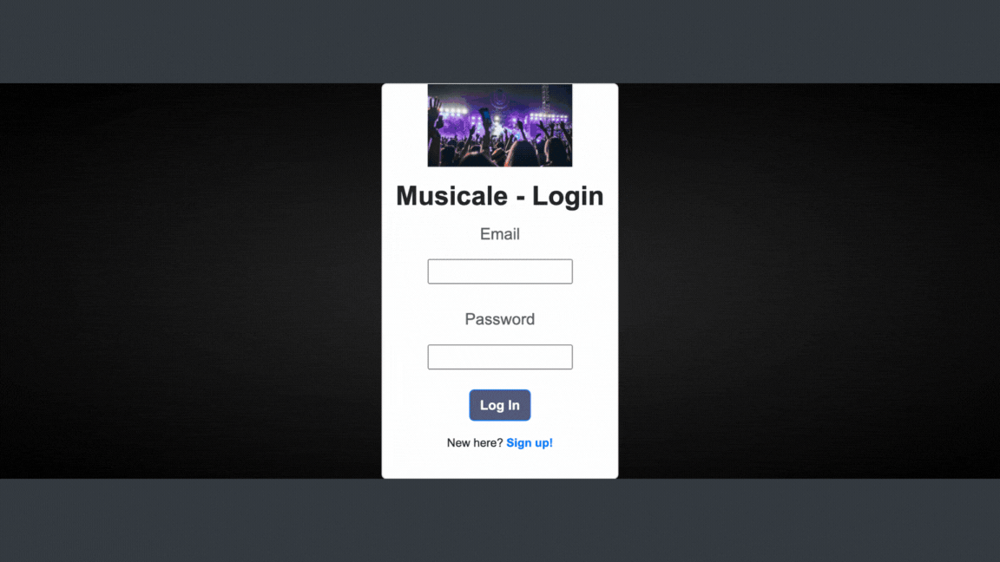

# Musicale
  

  ## Description
  This application combines the functionality of Ticketmaster with the organization that a calendar provides. Users are able to search for concerts by city and save them to their calendar to easily see the upcoming music events they are interested in or have purchased tickets for. 

  ## Table of Contents 
 * [Installation](#installation) 
 * [Usage](#usage) 
 * [License](#license) 
 * [Technologies](#technologies) 
 * [Deployed Application](#deployed-application)

  ## Installation

  For installation, type the following commands into the command line.
  
    To install packages:
      npm i

    To connect to the MySQL shell:
      mysql -u root -p > source/db.schema.sql
 
    To seed the database:
      npm run seed

    To start the server:
      node server

  ## Usage

  To use this project, users will have to sign up or login to view the main page, which is their calendar. There is a searchbar located at the top of the main page that allows them to search local music events by city. For those events they can see the search results for the city below the calendar with the artist, tour name, dates, and click on a link to buy tickets. If interested, they can choose to add that event to their calendar for easy access.

  ## License 

  This application is licensed under the [MIT license.](https://github.com/git/git-scm.com/blob/main/MIT-LICENSE.txt)

  ## Technologies

  * [Full Calendar JavaScript Library](https://fullcalendar.io/docs)
  * [Ticketmaster API](https://developer.ticketmaster.com/products-and-docs/apis/getting-started/)
  * [Bootstrap](https://getbootstrap.com/)

  ## Deployed Application
  [Deployed Application](https://musicale-app-f8a5312a774d.herokuapp.com/)
  
  